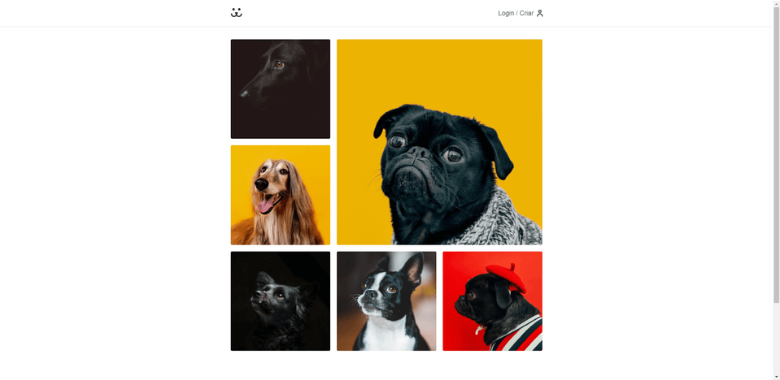

<h1 align="center">
     <a href="https://dogss-app.herokuapp.com" alt="app-dogs"> Dogs App </a>
</h1>

Dogs App é uma rede social para cachorros, desenvolvido durante o curso de [React](https://www.origamid.com/curso/react-completo/)
da [Origamid](https://www.origamid.com/). É possível postar fotos, comentar e interagir com outros usuários.

---

## Demonstração da aplicação

<p align="center" style="display: flex; align-items: flex-start; justify-content: center;">
  
</p>

---

### Pré-requisitos

Antes de começar, você vai precisar ter instalado em sua máquina as seguintes ferramentas:
[Git](https://git-scm.com), [Node.js](https://nodejs.org/en/) e [Yarn](https://yarnpkg.com/).

---

### Rodando a aplicação

```
# Clone este repositório
$ git clone https://github.com/lucasfe4nor/app-dogs.git

# Acesse a pasta do projeto no terminal/cmd para ter acesso a raiz da pasta
$ cd app-dogs

# Instale as dependências
$ yarn

# Execute a aplicação
$ yarn start

# A aplicação será aberta na porta:3000 - acesse http://localhost:3000
```

---

## Tecnologias

- **[React](https://reactjs.org/)**
- **[React Router Dom](https://github.com/ReactTraining/react-router/tree/master/packages/react-router-dom)**

---

## Status

Concluído ✔️✔️✔️

---

## 👨‍💻 Autor

- **Lucas Sampaio (lucasfe4nor)** - [Twitter](https://twitter.com/lucasfe4nor) - [LinkedIn](https://www.linkedin.com/in/lucasgbsampaio/)
